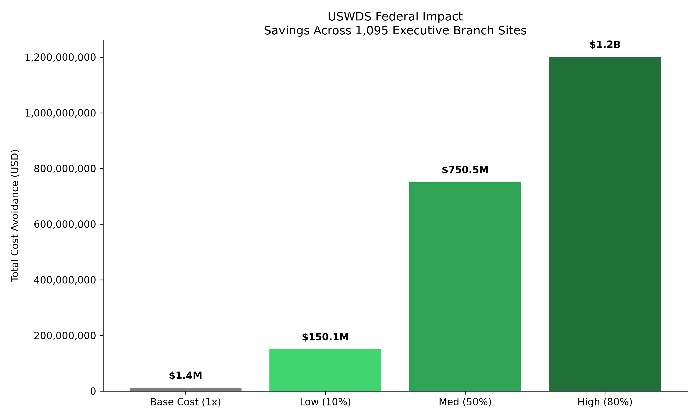
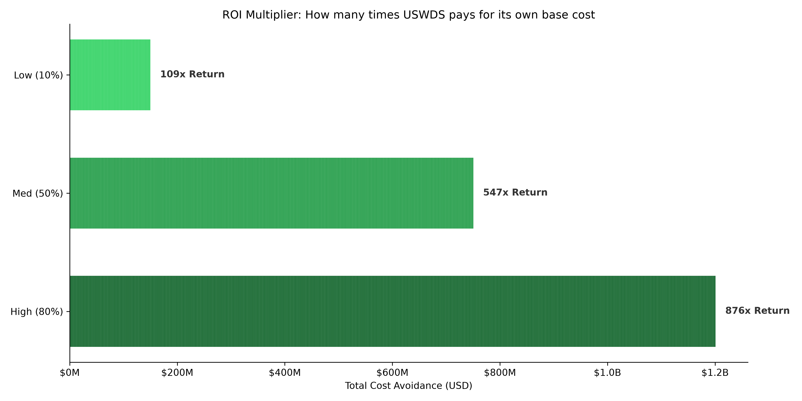
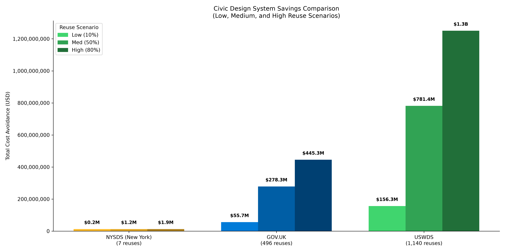
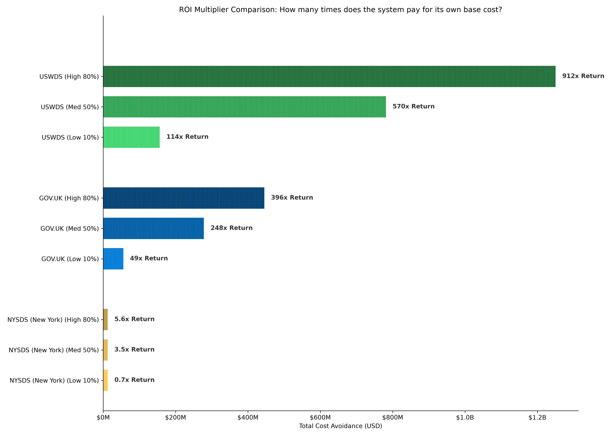

# Design Systems Cost Savings Estimator

This repository contains lightweight Python tools designed to estimate the cost avoidance and Return on Investment (ROI) generated by open-source design systems.

It contains two distinct analyses:
1. **USWDS Federal Impact:** A highly accurate estimate of the U.S. Web Design System's value across live federal domains.
2. **Civic Design Systems Comparison:** A comparative analysis evaluating USWDS against international (GOV.UK) and state-level (NYSDS) peers using open-source proxies.

---

## 🇺🇸 USWDS Federal Impact Analysis

This analysis focuses exclusively on the value generated by USWDS across the federal government, utilizing highly defensible, first-party telemetry rather than open-source proxy metrics.

### Methodology
* **Base Reproduction Cost:** $1,370,828 (Generated via `scc` on the core USWDS repository, actively excluding vendor libraries while including all End-to-End automated testing suites).
* **Federal Reach:** **1,095** live executive branch sites. This is based on the latest officially submitted counts, ensuring a defensible baseline (Note: GSA's automated Site Scanning Analysis routinely counts ~985+ domains, though known scanning limitations mean the true count is likely higher).
* **Discount Scenarios:** We apply conservative (10%), moderate (50%), and high (80%) discount factors to account for partial adoption.

### Visualized ROI

#### Cost Avoidance Scenarios


#### Ecosystem ROI Multiplier


### Running the Script
To generate the USWDS specific charts and command-line report:
```bash
python uswds_federal_savings.py
```

---

## 🌍 Civic Design Systems Comparison

Because live domain telemetry is rarely available for other government systems, this secondary analysis uses open-source proxy metrics (GitHub Forks + NPM Dependents) to compare USWDS against the UK Government (GOV.UK) and the New York State Design System (NYSDS).

### Configuration Values
*Data reflects the current baseline configuration in the comparison script.*

| Design System | Base Reproduction Cost | GitHub Forks | NPM Dependents | Total Reuses |
| :--- | :--- | :--- | :--- | :--- |
| **USWDS** | $1,370,828 | 1,100 | 40 | **1,140** |
| **GOV.UK** | $1,122,301 | 369 | 127 | **496** |
| **NYSDS (New York)** | $339,456 | 4 | 3 | **7** |

### Visualized Comparison

#### Grouped Savings Comparison


#### Multi-Framework ROI Multiplier


### Running the Script
To generate the comparative charts and command-line report:
```bash
python compare_civic_design_systems.py
```

---

## 🚀 Getting Started

### Prerequisites
Ensure you have Python 3 installed on your machine. You will also need the `matplotlib` and `numpy` libraries for generating the comparative charts.

```bash
pip install matplotlib numpy
```

## 🛠 Modifying the Data
Both scripts (`uswds_federal_savings.py` and `compare_civic_design_systems.py`) are designed to be easily configurable. Open the files and modify the values in the `CONFIGURATION` blocks at the top. The scripts contain comments with the exact `scc` commands and source URLs needed to pull fresh, accurate baseline costs.